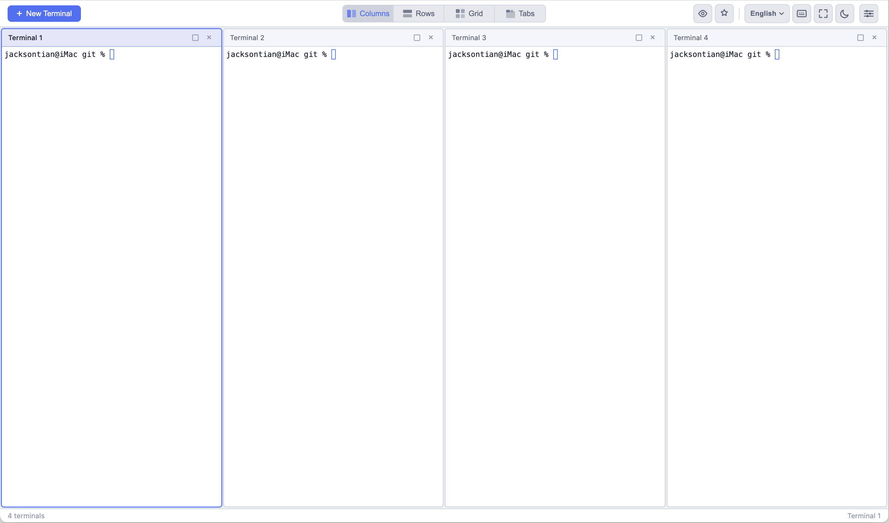
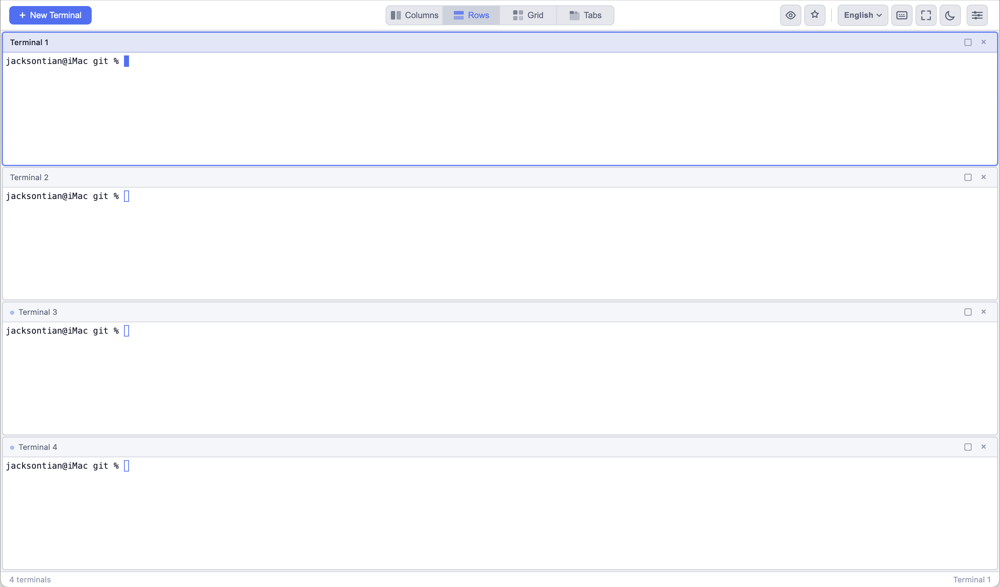
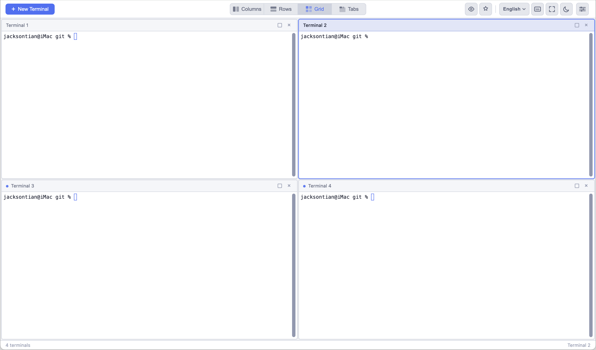
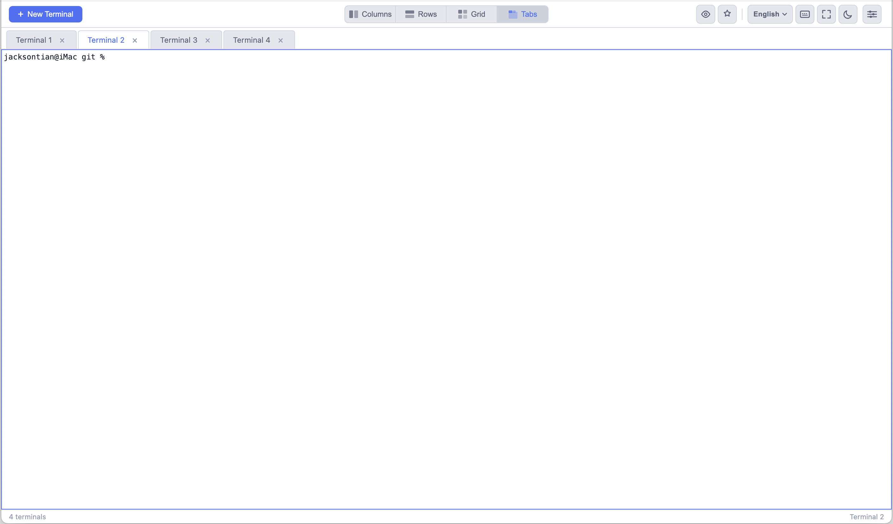

# mwt - Multi-Window Terminal

A lightweight web-based multi-window terminal for **local development**. Run multiple shell sessions in the browser with columns, rows, grid, and tab layouts.

> **Note:** mwt is designed for local use on your development machine. It does not provide authentication, encryption, or any access control — do not expose it to the network.

[](https://www.npmjs.com/package/@jacksontian/mwt)
[](https://www.npmjs.com/package/@jacksontian/mwt)
[](https://nodejs.org)
[](LICENSE)

## Layouts

### Columns



### Rows



### Grid



### Tabs



## Why mwt?

### 设计动机

日常开发中，我们经常需要同时运行多个终端会话：一个跑开发服务器，一个跑测试，一个执行 git 操作，还有一个用来查看日志。现有的方案要么太重，要么上手成本不低：

- **tmux / screen** — 功能强大，但快捷键体系需要专门学习，配置门槛较高，对新手不够友好
- **VS Code 内置终端** — 使用方便，但你不得不启动一个完整的 IDE，仅仅为了开几个终端窗口
- **iTerm2 / Windows Terminal** — 依赖特定操作系统，无法跨平台统一体验
- **ttyd / Wetty / code-server** — 面向远程场景设计，功能和配置远超本地开发所需

mwt 想解决的问题很简单：**给本地开发提供一个轻量、直觉化、开箱即用的多窗口终端**。

在 AI 时代，这个需求变得更加迫切。真正发挥生产力的方式不是盯着一个 AI 等它输出，而是**同时指挥多个 AI 工具并行干活**——一个窗口让 Claude Code 重构后端，一个窗口让另一个 Agent 写测试，一个窗口盯着构建日志，一个窗口查文档。mwt 天然适合这种「一人指挥，多路并发」的工作模式：轻量启动、多窗口并排、一眼掌控全局。

### 设计原则

**极简依赖** — 后端仅依赖 node-pty 和 ws 两个包，前端使用原生 ES Modules + xterm.js，没有框架、没有构建工具、没有打包步骤。`npx @jacksontian/mwt` 一行命令即可启动。

**浏览器即界面** — 选择浏览器作为 UI 层，天然跨平台，不需要安装桌面应用。布局切换、主题跟随、快捷键操作都在浏览器中完成，所见即所得。

**会话不丢失** — 每个终端保留 100KB 的输出缓冲区，刷新页面或网络断开后可以恢复现场；断线 30 分钟内服务端保留会话，自动重连后回放缓冲。**同一 `sessionId` 同时只允许一个标签页保持 WebSocket**，新开标签页会被拒绝，避免多页争抢同一组 PTY。详见下文 **Session & recovery**。

**够用就好** — 不做 SSH、不做认证、不做插件系统。mwt 只专注于一件事：在本地高效地管理多个终端窗口。功能边界清晰，代码量控制在 2000 行左右，任何人都可以快速理解和修改。

## Features

- **Multi-terminal** - Create and manage multiple terminal sessions simultaneously
- **Four layouts** - Columns, rows, grid, and tabs, switch anytime
- **Session persistence** - Reconnect without losing recent terminal output (100KB buffer per terminal); **one browser tab** may be connected per session (see **Session & recovery**)
- **Auto-reconnect** - WebSocket disconnection recovery with exponential backoff
- **Dark / Light theme** - Manual toggle or follow system preference
- **Keyboard-driven** - Full keyboard shortcut support
- **Zero build step** - No webpack, no bundler, just run

## Quick Start

```bash
npx @jacksontian/mwt
```

Or install globally:

```bash
npm install -g @jacksontian/mwt
mwt
```

Then open http://localhost:1987 in your browser.

## Usage

```
mwt [options]

Options:
  -p, --port <port>  Port to listen on (default: 1987)
  -h, --help         Show this help message
```

Example:

```bash
mwt -p 8080
```

## Session & recovery

Understanding how the browser talks to the server avoids surprises (especially with multiple tabs).

| Topic | Behavior |
|--------|----------|
| **Session ID** | On first visit, the page stores a UUID in `localStorage` under `mwt-session-id`. Every WebSocket connection sends this id so the server can attach to the same logical session (same PTY processes) after a refresh. |
| **Single active tab (互斥连接)** | Only **one** browser tab may keep the WebSocket open for that session. If you open mwt in a **second** tab while the first is still connected, the new tab’s connection is **rejected** and you see a full-page message: *mwt is already open in another tab.* This is intentional: two tabs would both try to drive the same shells. Close the other tab or use one tab only. |
| **Refresh & reconnect** | Reloading the **same** tab disconnects briefly, then reconnects with the same `sessionId`. Existing terminal ids are restored; the server replays recent output from its per-terminal ring buffer (see below). |
| **Output buffer** | While connected, the server keeps the **last ~100 KB** of output per terminal. After reconnect, that chunk is sent to the client so you don’t lose recent scrollback. It is not a full session log. |
| **Idle cleanup** | If **no** tab is connected for **30 minutes**, the server **kills** that session’s shells and clears its state. The next visit still uses the same `sessionId` in `localStorage`, but you’ll get an **empty** session (no old terminals)—create new ones as needed. |

**Summary:** one tab connected at a time; refresh is fine; a second simultaneous tab is blocked; long disconnects drop server-side sessions after 30 minutes.

## Keyboard Shortcuts

| Shortcut | Action |
|---|---|
| `Ctrl+Shift+T` | New terminal |
| `Ctrl+Shift+W` | Close active terminal |
| `Ctrl+Shift+]` | Next terminal |
| `Ctrl+Shift+[` | Previous terminal |
| `Alt+1-9` | Switch to terminal N |
| `Ctrl+Shift+M` | Maximize / restore active terminal |
| `F11` | Toggle fullscreen |

## Architecture

```
Browser                          Server (Node.js)
┌──────────────┐    WebSocket    ┌──────────────┐
│  xterm.js    │◄──────────────►│  node-pty     │
│  App.js      │                │  RingBuffer   │
│  LayoutMgr   │                │  Session Mgr  │
│  ThemeMgr    │                └──────────────┘
└──────────────┘
```

- **Frontend** - Vanilla JS + xterm.js, no framework
- **Backend** - Node.js HTTP server + WebSocket (ws)
- **PTY** - node-pty spawns real shell processes
- **Buffer** - RingBuffer keeps last 100KB output per terminal for session restore

## Dependencies

Only two runtime backend dependencies:

- [node-pty](https://github.com/microsoft/node-pty) - Pseudo-terminal management
- [ws](https://github.com/websockets/ws) - WebSocket server

Frontend uses [xterm.js](https://xtermjs.org/) with fit and web-links addons, served from node_modules.

## Comparison

| | mwt | tmux / screen | iTerm2 / Windows Terminal | VS Code 终端 | ttyd | Wetty | code-server |
|---|---|---|---|---|---|---|---|
| **多终端管理** | ✅ 并排 / 网格 / 标签页 | ✅ 窗格 / 窗口 | ✅ 标签页 / 分屏 | ✅ 分屏 / 标签页 | ❌ 单终端 | ❌ 单终端 | ✅ 内嵌终端 |
| **运行环境** | 浏览器 | 终端 | macOS 专属 | 桌面应用 | 浏览器 | 浏览器 | 浏览器 |
| **跨平台** | ✅ 任意有浏览器的系统 | ✅ Unix/Linux/macOS | ❌ macOS only | ✅ | ✅ | ✅ | ✅ |
| **上手成本** | 零配置，开箱即用 | 高，需学习快捷键体系 | 低 | 低（需安装 IDE） | 低 | 中等 | 中等 |
| **安装体积** | ~2MB（2 个运行时依赖） | 系统包管理器安装 | ~30MB | ~300MB+ | ~1MB（C 编译） | ~50MB | ~200MB+ |
| **构建步骤** | 无 | 无 | N/A | N/A | 需编译 C | 需 npm install | 需编译 |
| **会话持久化** | ✅ 100KB 缓冲 + 自动重连 | ✅ detach/attach | ❌ | ❌ | ❌ | ❌ | ❌ |
| **布局切换** | ✅ 三种布局一键切换 | ✅ 手动分屏 | ✅ | ✅ | ❌ | ❌ | ✅ |
| **主题切换** | ✅ 深色/浅色 + 跟随系统 | 需手动配置 | ✅ | ✅ | ❌ | ❌ | ✅ |
| **远程/SSH** | ❌ 仅本地 | ✅ | ✅ | ✅ | ✅ | ✅ | ✅ |
| **认证/权限** | ❌ 不需要 | N/A | N/A | N/A | 可选 | ✅ | ✅ |
| **适用场景** | 本地开发多终端 | 服务器运维/本地开发 | macOS 日常使用 | 编码 + 终端一体化 | 远程单终端 | 远程终端 | 远程开发 |

**mwt 的定位**：如果你只是想在本地开发时开几个终端窗口，不想为此启动一个 IDE，也不想花时间学 tmux，mwt 是最轻量的选择。它不试图替代任何一个竞品，而是填补了「本地轻量多终端」这个细分场景的空白。

## Limitations

mwt is intentionally simple. It does **not** support:

- SSH or remote server connections — local shell only
- Authentication / HTTPS — not needed for localhost
- File editing — use your own editor
- Plugin system — keep it minimal

If you need remote access or multi-user support, consider [ttyd](https://github.com/tsl0922/ttyd), [Wetty](https://github.com/butlerx/wetty), or [code-server](https://github.com/coder/code-server).

## License

MIT
